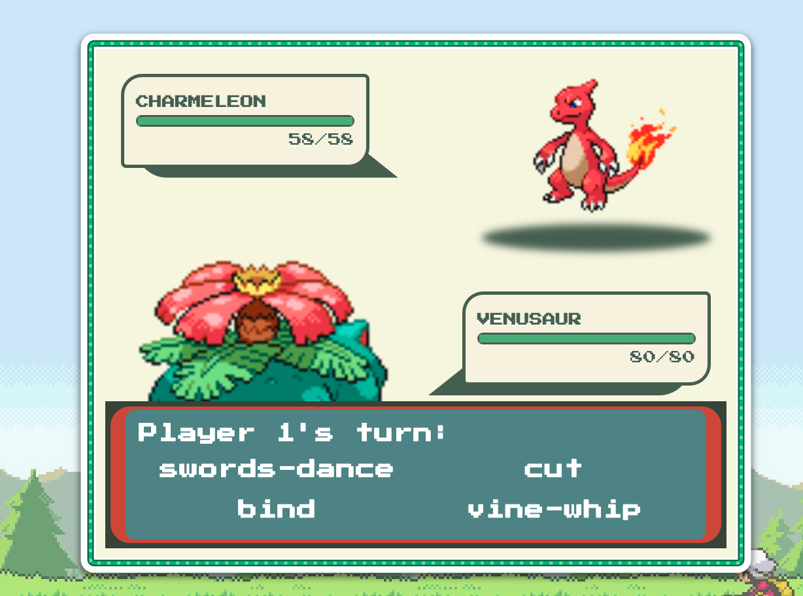

**This is the Pokemon Game made with React Hooks and Redux**

Once you download this project, you just to run these command lines.

to install node_modules
- npm install

And then to run the front
- npm start

This is what it looks like

 

This is how pokedex looks like

 

This is how you can choose your pokemon

 

Also you can see pokemon's stats

 

Enjoy. :smirk:
